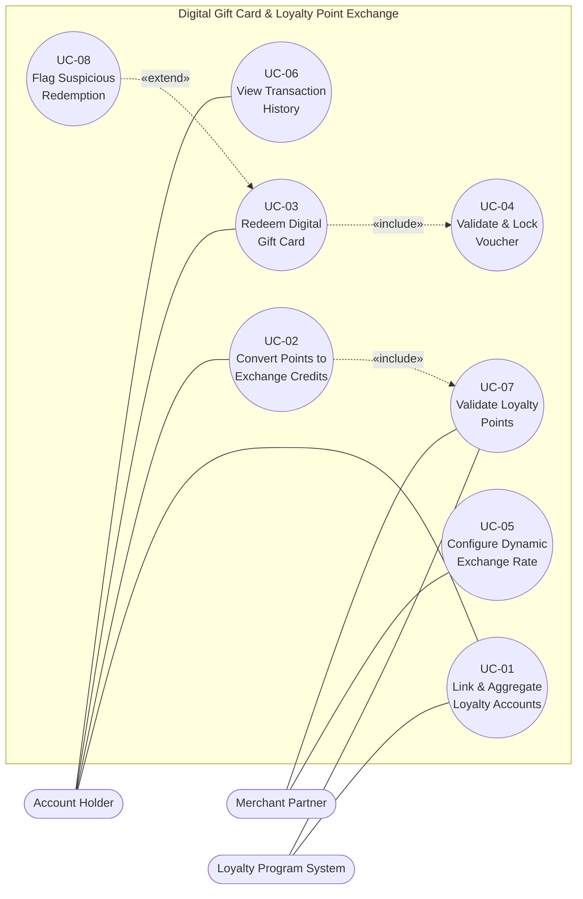

# UML Use-Case Diagram

**Problem Statement #34 — Digital Gift Card & Loyalty Point Exchange**
**SRN:** PES1UG24CS221

The diagram models the three actors, eight use cases, and includes **two «include»**
relationships and **one «extend»** relationship (as required).

- PlantUML source (source of truth): [diagrams/usecase_diagram.puml](diagrams/usecase_diagram.puml)
- draw.io source: [diagrams/usecase_diagram.drawio](diagrams/usecase_diagram.drawio)
  (open at [app.diagrams.net](https://app.diagrams.net), then `File → Export as → PDF`)
- A GitHub-renderable Mermaid approximation is shown below.

---

## Actors
- **Account Holder** — links loyalty accounts, converts points, redeems gift cards, views history.
- **Merchant Partner** — configures the dynamic exchange rate; validates loyalty points.
- **Loyalty Program System** — external system that provides/validates loyalty-point balances.

## Relationships
- **«include»**: UC-02 *Convert Points to Exchange Credits* → UC-07 *Validate Loyalty Points* (points must be validated before conversion).
- **«include»**: UC-03 *Redeem Digital Gift Card* → UC-04 *Validate & Lock Voucher* (every redemption locks a single-use voucher).
- **«extend»**: UC-08 *Flag Suspicious Redemption* → UC-03 *Redeem Digital Gift Card* (only abnormal redemptions trigger fraud handling).

---

## Mermaid rendering (view on GitHub)

**Legend**
- Rounded pills outside the boundary = **actors**.
- Ovals inside the boundary = **use cases**.
- Dotted arrows labelled «include» / «extend» = **stereotyped dependencies**.
