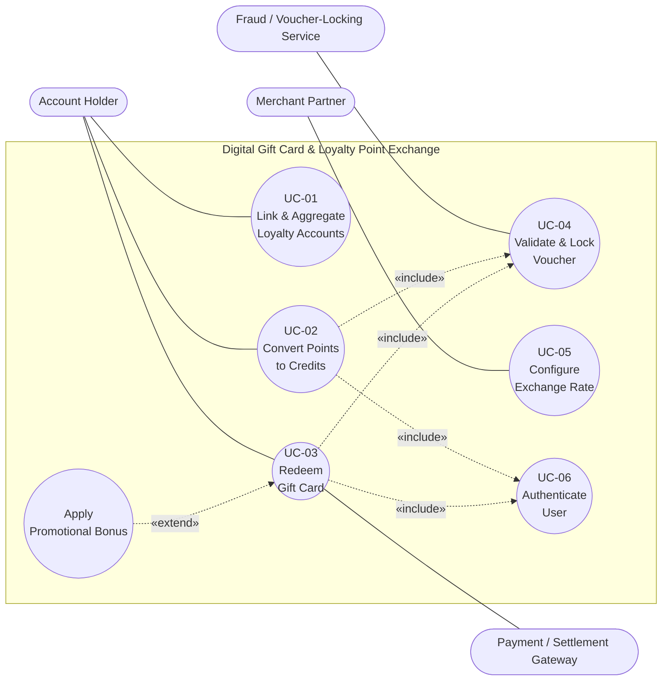

# UML Use-Case Diagram

**Problem Statement #34 — Digital Gift Card & Loyalty Point Exchange**
**SRN:** PES1UG24CS221

The diagram models all actors, the primary use cases, and includes **two «include»**
relationships and **one «extend»** relationship (as required).

- PlantUML source: [diagrams/use_case_diagram.puml](diagrams/use_case_diagram.puml)
  (render at [plantuml.com](https://www.plantuml.com/plantuml/uml/), draw.io, or Lucidchart, then export to PDF)
- A GitHub-renderable Mermaid approximation is shown below.

---

## Mermaid rendering (view on GitHub)

**Legend**
- Rounded pills on the outside = **actors**.
- Ovals inside the boundary = **use cases**.
- Dotted arrows labelled «include» / «extend» = **stereotyped dependencies**.
- «include»: UC-02 and UC-03 always call UC-04 (Validate & Lock Voucher) and UC-06 (Authenticate).
- «extend»: *Apply Promotional Bonus* optionally extends UC-03 when a promotion is active.
