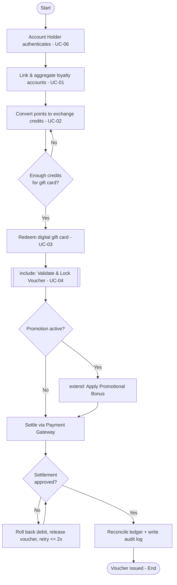

# Use-Case Flow Specification

**Problem Statement #34 — Digital Gift Card & Loyalty Point Exchange**
**SRN:** PES1UG24CS221

---

## Use Case: **UC-03 — Redeem Digital Gift Card**

| Field | Value |
|-------|-------|
| **Use Case ID** | UC-03 |
| **Primary Actor** | Account Holder |
| **Supporting Actors** | Fraud/Voucher-Locking Service, Payment/Settlement Gateway |
| **Related Requirements** | FR-001, FR-004, NFR-001, NFR-002 |

### Preconditions
1. The Account Holder is authenticated (UC-06) and has an active wallet.
2. The wallet holds sufficient exchange credits for the requested gift card.
3. At least one Merchant Partner has active gift-card inventory.

### Postconditions (on success)
1. A single-use digital gift-card voucher is issued to the Account Holder.
2. The voucher status is set to `LOCKED` (cannot be redeemed again).
3. The wallet credit balance is decremented and the ledger is reconciled (zero drift).
4. The transaction is written to the immutable audit log.

---

### Main Success Scenario
1. Account Holder selects **"Redeem Gift Card"** and chooses a brand and denomination.
2. System displays the required credit amount and the current dynamic rate for confirmation.
3. Account Holder confirms the redemption.
4. System **includes** *Validate & Lock Voucher* (UC-04): it generates a single-use voucher code with a cryptographic checksum and marks it `LOCKED`.
5. System debits the exchange credits from the wallet.
6. System connects to the Payment/Settlement Gateway to settle the gift-card value.
7. Gateway authorises and confirms settlement.
8. System reconciles the ledger (confirms zero balance drift) and writes an audit-log entry.
9. System displays the voucher code and emails/pushes a receipt to the Account Holder.
10. Use case ends successfully.

---

### Alternate Flow A — Insufficient Credits (at step 2)
- **2a1.** System detects the wallet balance is below the required credit amount.
- **2a2.** System shows *"Insufficient credits"* and offers UC-02 (*Convert Points to Credits*).
- **2a3.** If the Account Holder converts enough points, flow resumes at step 3; otherwise the use case ends without issuing a voucher.

### Alternate Flow B — Payment / Settlement Declined (at step 7)
- **7b1.** Gateway returns a declined/timeout response.
- **7b2.** System displays a settlement-failed message.
- **7b3.** System **rolls back** the credit debit (step 5) and releases the locked voucher so no value is lost.
- **7b4.** Account Holder is prompted to retry. After **2 failed attempts** the redemption is cancelled and the Account Holder is notified.

### Alternate Flow C — Duplicate / Expired Voucher (at step 4)
- **4c1.** Fraud/Voucher-Locking Service detects the generated code collides with an existing or expired voucher.
- **4c2.** System discards the code and regenerates a fresh single-use voucher.
- **4c3.** If regeneration fails twice, the transaction is aborted and logged as a fraud-guard event.

---

## Overall Project Flow (end-to-end)

*Merchant Partner side runs in parallel:* the Merchant configures the dynamic
exchange rate (UC-05), which feeds the rate used in UC-02 and UC-03.
