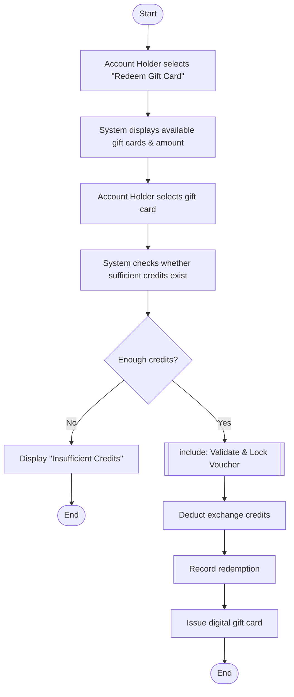

# Use-Case Flow Specification

**Problem Statement #34 — Digital Gift Card & Loyalty Point Exchange**
**SRN:** PES1UG24CS221

---

## Use Case: **UC-03 — Redeem Digital Gift Card**

| Field | Value |
|-------|-------|
| **Use Case ID** | UC-03 |
| **Primary Actor** | Account Holder |
| **Supporting Actor** | Merchant Partner |
| **Related Requirements** | FR-001, FR-004, NFR-001, NFR-002 |

### Preconditions
1. The Account Holder has an active wallet.
2. The Account Holder has sufficient universal exchange credits.
3. A valid digital gift card is available.
4. The selected gift-card denomination is supported.

### Main Success Scenario
1. Account Holder selects **Redeem Digital Gift Card**.
2. System displays available gift cards and denominations.
3. Account Holder selects a gift card.
4. System displays the required exchange-credit amount.
5. Account Holder confirms the redemption.
6. System verifies that the Account Holder has sufficient exchange credits.
7. System **includes** *UC-04 Validate & Lock Voucher*.
8. System deducts the required exchange credits from the Account Holder's wallet.
9. System records the redemption transaction.
10. System displays the generated single-use digital gift-card voucher.
11. Use case ends successfully.

### Alternate Flow A — Insufficient Exchange Credits (at step 6)
- **6a.** System detects that the Account Holder does not have enough exchange credits.
- **6b.** System displays an *"Insufficient Exchange Credits"* message.
- **6c.** System does not deduct any credits.
- **6d.** System does not generate a voucher.
- **6e.** Account Holder may return to the wallet and convert additional loyalty points.
- **6f.** Use case ends without redemption.

### Postconditions (on success)
1. The required exchange credits have been deducted.
2. A digital gift-card voucher has been generated.
3. The voucher is locked as single-use.
4. The redemption transaction is recorded.
5. The Account Holder can view/use the voucher.

---

## Flow diagram (view on GitHub)

A draw.io version of this flow is provided at
[diagrams/usecase_flow.drawio](diagrams/usecase_flow.drawio). The written specification
above is the primary deliverable the handout asks for.
